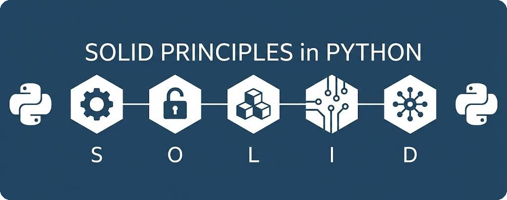

# SOLID Principles in Python

<p align="center">
  
</p>

<p align="center">
  <b>Learn SOLID design principles through Python examples — violation vs correct, with UML diagrams.</b>
</p>

<p align="center">
  <a href="https://yakhyo.github.io/solid-python/">Documentation</a> · <a href="https://yakhyo.github.io/solid-python/uz/">O'zbekcha</a>
</p>

## Quick start

```bash
python docs/01-srp/violation.py
python docs/01-srp/correct.py
```

Requires **Python 3.10+**, no external dependencies.

## Docs site locally

```bash
bundle install
bundle exec jekyll serve --livereload
```

Then open `http://localhost:4000/solid-python/`

## Structure

```text
docs/
├── 01-srp/              # Single Responsibility
├── 02-ocp/              # Open/Closed
├── 03-lsp/              # Liskov Substitution
├── 04-isp/              # Interface Segregation
├── 05-dip/              # Dependency Inversion
│   ├── violation.py     # What goes wrong
│   ├── correct.py       # How to fix it
│   ├── README.md        # English docs
│   └── README.uz.md     # Uzbek docs
├── index.md             # Home (EN)
└── index.uz.md          # Home (UZ)
```

## License

MIT — [LICENSE](LICENSE)
